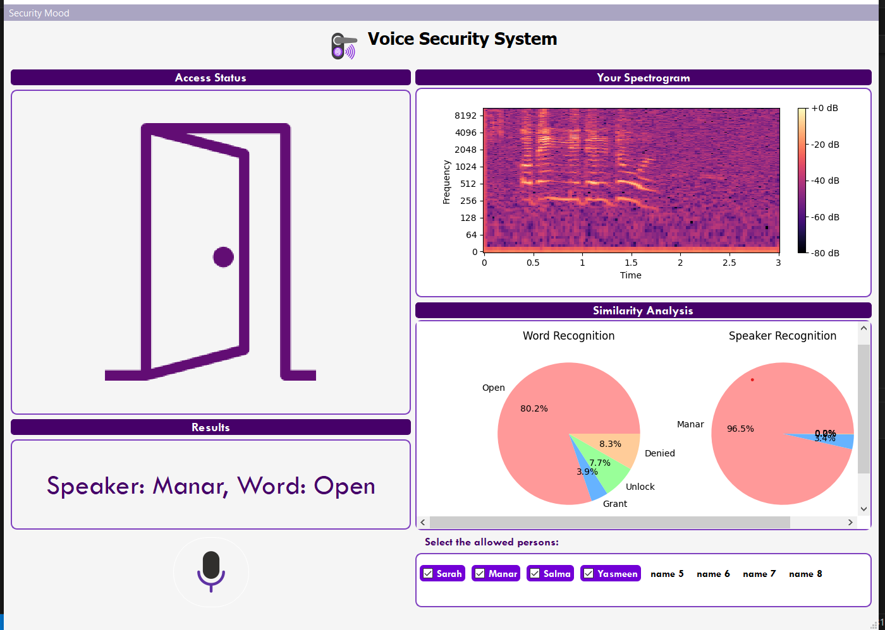

# Security Voice-code Access
## Introduction
Security Voice-code Acccess is a software component designed for implementing security voice-code access systems based on fingerprint and spectrogram concepts. 
## Features
* Dual Operation Modes: Operates in two modes: Security Voice Code and Security Voice Fingerprint.
* Voice Code Access: In Security Voice Code mode, access is granted based on the spoken passphrase matching one of the predefined passcode sentences.
* Passcode Sentences: Supports multiple passcode sentences such as "Open middle door," "Unlock the gate," or "Grant me access."
* Voice Fingerprint Access: In Security Voice Fingerprint mode, access is granted based on the match between the spoken voice-code and stored voiceprints of authorized individuals.
* Individual Authorization: Allows users to select which individuals among the trained 8 users are granted access.
* Spectrogram Viewer: Displays the spectrogram of the spoken voice-code for visual analysis.
* Analysis Summary: Presents a summary of the analysis results, including match percentages for predefined passcode sentences and stored individuals' voiceprints.
* User Interface: Intuitive user interface with clear controls for mode selection, voice recording, spectrogram visualization, and result display.
* Performs authentication in real-time, providing instant feedback on access status.

## Usage
* Mode Selection: Choose between Security Voice Code mode or Security Voice Fingerprint mode.
*Recording Voice-Code: Click the button to start recording the voice-code.
* Spectrogram Viewer: Visualize the spectrogram of the spoken voice-code.
* Analysis Results: View a summary of the analysis results, including:
  * A diagram showing the match percentages for each of the predefined passcode sentences.
  * A diagram showing the match percentages for each of the stored individuals' voiceprints.
* Access Status: Receive feedback on access status, either "Access gained" or "Access denied."
